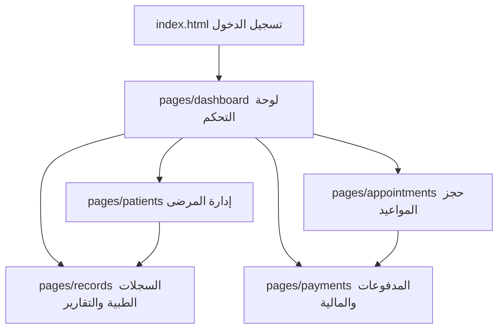
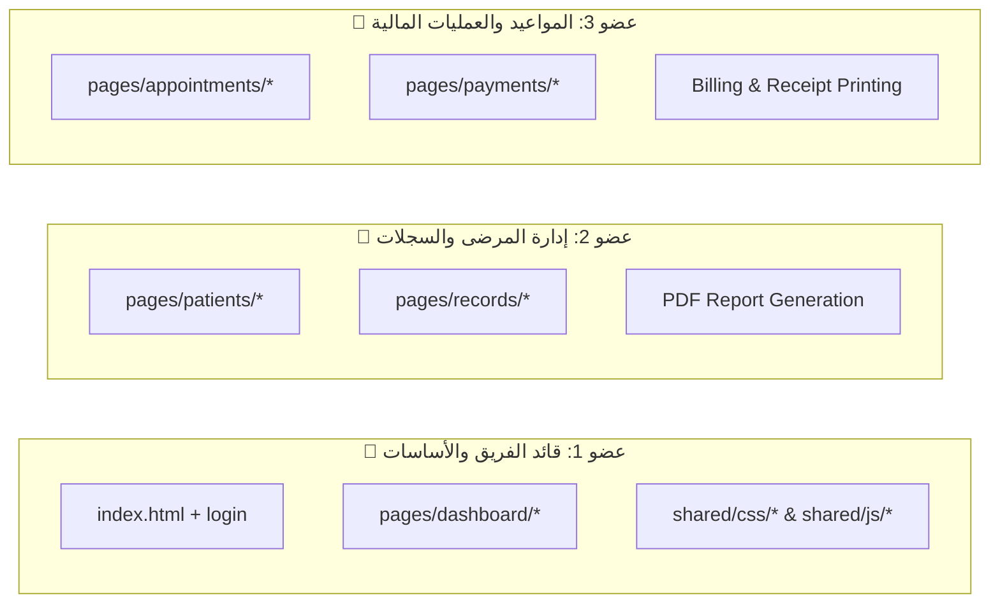

# 🦷 نظام إدارة عيادة الأسنان الحديث (Dental Clinic Management System)
> **مشروع مقرر هندسة البرمجيات (Software Engineering Course Project)**
> 
> نظام متكامل لإدارة العيادات الطبية مبني بالكامل على تقنيات الويب النقية (**Pure HTML5, CSS3, Vanilla JavaScript**) ومصمم وفق مبادئ ومعايير هندسة البرمجيات العالمية (**Modularity, High Cohesion, Low Coupling, Separation of Concerns**).

---

## 🌟 مميزات النظام المعمارية
- **⚡ تشغيل فوري بدون خوادم (Zero Configuration):** يعمل مباشرة على أي متصفح ويب أو عبر **GitHub Pages** أو **Live Server** دون الحاجة لتثبيت سيرفرات (مثل XAMPP/Apache) أو قواعد بيانات MySQL.
- **📦 بنية معمارية معيارية (Modular Architecture):** كل صفحة في النظام لها مجلد خاص يحتوي على ثلاثية الويب الخاصة بها (`HTML` + `CSS` + `JS`).
- **🗄️ محرك تخزين محلي ذكي (Local Data Engine):** استخدام `localStorage` لإدارة عمليات الـ CRUD والبيانات المرجعية والنسخ الاحتياطي والاستعادة (`JSON Backup/Restore`).
- **📊 لوحة قيادة ورسوم بيانية تفاعلية:** إحصائيات فورية للمرضى، مواعيد اليوم، التحصيل المالي، ورسوم بيانية عبر `Chart.js`.
- **📑 تقارير وفواتير طبية:** استخراج تقارير دورية وطباعة سندات القبض وتصدير ملفات `PDF` مباشرة عبر المتصفح.
- **🌙 الوضع الليلي التفاعلي (Dark/Light Mode):** مظهر داكن مريح للعين مع حفظ تفضيل المستخدم محلياً.
- **📱 تصميم متجاوب (Responsive Design):** متوافق 100% مع كافة الشاشات والأجهزة الذكية.

---

## 🏗️ الهيكلية المعمارية للملفات (Project Structure)

```text
ab/
│
├── index.html                           # البوابة الرئيسية وتسجيل الدخول (Entry Point)
│
├── pages/                               # وحدات وصفحات النظام المستقلة
│   ├── login/
│   │   ├── login.css                    # تصميم صفحة تسجيل الدخول
│   │   └── login.js                     # منطق التحقق وإدارة الجلسات
│   │
│   ├── dashboard/                       # [عضو الفريق 1] لوحة التحكم والتحليلات
│   │   ├── dashboard.html
│   │   ├── dashboard.css
│   │   └── dashboard.js
│   │
│   ├── patients/                        # [عضو الفريق 2] إدارة المرضى والسجلات
│   │   ├── patients.html
│   │   ├── patients.css
│   │   └── patients.js
│   │
│   ├── records/                         # [عضو الفريق 2] السجلات الطبية وتقارير PDF
│   │   ├── records.html
│   │   ├── records.css
│   │   └── records.js
│   │
│   ├── appointments/                    # [عضو الفريق 3] حجز المواعيد والزيارات
│   │   ├── appointments.html
│   │   ├── appointments.css
│   │   └── appointments.js
│   │
│   └── payments/                        # [عضو الفريق 3] إدارة المدفوعات والمالية
│       ├── payments.html
│       ├── payments.css
│       └── payments.js
│
├── shared/                              # الطبقة المشتركة (Shared Core Layer)
│   ├── css/
│   │   ├── variables.css                # متغيرات التصميم والألوان والسمات
│   │   ├── global.css                   # التنسيقات العامة والقوائم والجداول
│   │   └── responsive.css               # قواعد التوافق مع الهواتف والأجهزة اللوحية
│   │
│   └── js/
│       ├── mock-data.js                 # البيانات الأولية التجريبية (Seed Data)
│       ├── storage.js                   # مدير التخزين والـ CRUD (بديل الـ Backend)
│       ├── auth-guard.js                # حماية الصفحات وإدارة جلسة المستخدم
│       └── common.js                    # التنبيهات (Toast)، الساعة، والوضع الليلي
│
└── README.md                            # التوثيق الشامل ودليل العمل الجماعي
```

---

## 🖥️ الشرح التفصيلي لمكونات واجهات النظام (UI/UX & Component Specifications)

يوضح هذا القسم بالتفصيل كل ما تحتويه كل واجهة من **أزرار، حقول إدخال، جداول، عناصر تفاعلية، وتنبيهات**:



---

### 1️⃣ صفحة تسجيل الدخول (`index.html` + `pages/login/`)
- **الغرض:** التحقق من هوية المستخدم وحماية مسارات النظام من الوصول غير المصرح به.
- **العناصر والمكونات:**
  - **الشعار والهوية:** أيقونة السن المميزة واسم العيادة وعنوان النظام.
  - **حقل اسم المستخدم (`username`):** إدخال اسم المستخدم مع أيقونة مستخدم وفحص الإدخال التلقائي.
  - **حقل كلمة المرور (`password`):** حقل آمن لكلمة المرور مع دعم التعبئة التجريبية.
  - **مربع اختيار تذكرني (`remember-me`):** خيار حفظ الجلسة محلياً أو مؤقتاً.
  - **زر تسجيل الدخول (`btn-login-submit`):** يقوم بالتحقق من البيانات والتوجيه للوحة التحكم مع رسالة ترحيبية.
  - **تنبيه الخطأ (`login-error-alert`):** يظهر ديناميكياً باللون الأحمر عند إدخال بيانات غير صحيحة.
  - **زر الوضع الليلي العائم (`dark-mode-toggle`):** للتبديل بين الوضع الفاتح والداكن.

---

### 2️⃣ واجهة لوحة التحكم (`pages/dashboard/`)
- **الغرض:** عرض المؤشرات الحيوية والإحصائيات والرسوم البيانية لمساعدة الطبيب في إدارة العيادة.
- **العناصر والمكونات:**
  - **شريط الترحيب والساعة الحية (`live-clock-card`):** عرض التوقيت الحالي بالثواني مع التاريخ باللغة العربية.
  - **بطاقات المؤشرات الإحصائية السريعة (Stat Cards):**
    - **بطاقة إجمالي المرضى:** تعرض العدد الفعلي للمرضى المسجلين بالنظام.
    - **بطاقة مواعيد اليوم:** عدد الزيارات المقررة لتاريخ اليوم.
    - **بطاقة الإيرادات المحصلة:** إجمالي المبالغ المدفوعة (بالريال السعودي).
    - **بطاقة المستحقات والديون:** المبالغ المتبقية على المرضى الواجب تحصيلها.
  - **الرسوم البيانية التفاعلية (Chart.js):**
    - **رسم بياني خطي (Line Chart):** يوضح معدل تسجيل المرضى الجدد شهرياً.
    - **رسم بياني دائري (Doughnut Chart):** يوضح توزيع حالات المواعيد (مكتمل، جزئي، غير مدفوع).
  - **قسم الروابط السريعة (Quick Actions):**
    - زر `إضافة مريض جديد`: ينقل مباشرة إلى صفحة المرضى مع فتح النموذج.
    - زر `حجز موعد عيادة`: ينقل مباشرة إلى صفحة المواعيد.
    - زر `كشف المدفوعات`: ينقل مباشرة إلى صفحة الحسابات والمالية.
    - زر `تصدير نسخة احتياطية`: يقوم بإنشاء وتنزيل ملف `dental_clinic_backup.json` بكافة البيانات.
    - زر `استعادة نسخة احتياطية`: يسمح برفع ملف JSON واستعادة كافة بيانات العيادة فوراً.
  - **قائمة مواعيد اليوم:** جدول يعرض اسم المريض، نوع الإجراء الطبي، وقت الموعد، وشارة الحالة.

---

### 3️⃣ واجهة إدارة المرضى (`pages/patients/`)
- **الغرض:** إدارة السجلات الشخصية للمرضى وإضافة وتعديل وحذف الحالات الطبية.
- **العناصر والمكونات:**
  - **زر إضافة مريض جديد (`show-add-patient-btn`):** يقوم بإظهار نموذج الإدخال بحركة انسيابية.
  - **نموذج المريض المنزلق (Patient Form):**
    - حقل `اسم المريض الرباعي` (إلزامي).
    - حقل `رقم الهاتف الجوال` (إلزامي للبحث والتواصل).
    - حقل `تاريخ التسجيل` (تعبئة تلقائية بتاريخ اليوم مع إمكانية التعديل).
    - خيارات `الجنس` (أزرار اختيار Radio: ذكر / أنثى).
    - **حقل شرطي تفاعلي (حالة الحمل):** يظهر تلقائياً فقط إذا كان الجنس "أنثى" لتنبيه الطبيب بعدم استخدام الأشعة أو بعض أدوية التخدير.
    - خيارات `الأمراض المزمنة والحساسية` (نعم / لا).
    - **حقل شرطي تفاعلي (تفاصيل الأمراض):** يظهر عند اختيار "نعم" لإدخال تفاصيل السكري، الضغط، أو حساسية البنسلين.
    - حقل `الملاحظات الإضافية`: لتدوين أي ملاحظات طبية خاصة.
    - أزرار `حفظ بيانات المريض` و `إلغاء`.
  - **شريط البحث الفوري (`patient-search-input`):** تصفية وبحث لحظي بالاسم أو رقم الهاتف أو رقم الملف.
  - **جدول بيانات المرضى (Patients Data Table):**
    - أعمدة: رقم الملف، اسم المريض، الهاتف، الجنس، الحالة الصحية، تاريخ التسجيل، والإجراءات.
  - **أزرار الإجراءات لكل مريض:**
    - زر `السجل`: ينقل مباشرة للملف الطبي الشامل لهذا المريض.
    - زر `تعديل`: يفتح النموذج معبأً ببيانات المريض لتعديلها وحفظها.
    - زر `حذف`: حذف المريض مع رسالة تأكيد.

---

### 4️⃣ واجهة حجز وإدارة المواعيد (`pages/appointments/`)
- **الغرض:** تنظيم الزيارات وحساب التكاليف المالية للعمليات الطبية وإدارة مواعيد المراجعة.
- **العناصر والمكونات:**
  - **نموذج حجز الموعد (Appointment Form):**
    - قائمة منسدلة `اختيار المريض`: مربوطة لحظياً بقائمة المرضى المسجلين.
    - قائمة منسدلة `نوع الإجراء الطبي`: (كشف وتشخيص، تنظيف وتلميع، حشو تجميلي، سحب عصب، قلع جراحي، تركيبات وزراعة، تقويم، متابعة).
    - حقل `تاريخ الموعد` وحقل `وقت الموعد`.
    - **صندوق الحاسبة المالية التفاعلية (Financial Calculator):**
      - حقل `المبلغ الإجمالي`: تكلفة الإجراء بالريال.
      - حقل `المدفوع الآن`: المبلغ المسدد من قبل المريض في هذه الجلسة.
      - حقل `المبلغ المتبقي (آلياً)`: يتم حسابه فورياً وطرح المدفوع من الإجمالي لمنع الخطأ البشري.
      - شارة حالة الدفع اللحظية (تتغير تلقائياً إلى: كشف مجاني / مكتمل / دفع جزئي / غير مدفوع).
    - خيار `موعد المراجعة القادم` (نعم / لا):
      - عند اختيار "نعم" يظهر حقل `تاريخ المراجعة` وحقل `الغرض من المراجعة`.
    - حقل `الملاحظات الطبية والإرشادات`.
    - زر `حفظ وتأكيد الموعد` وزر `إعادة تعيين`.
  - **شريط البحث في جدول المواعيد:** للبحث السريع باسم المريض أو الإجراء الطبي.
  - **جدول المواعيد الشامل:** يعرض المواعيد مرتبة من الأحدث إلى الأقدم مع شارات ملونة لحالة السداد وأزرار التعديل والحذف.

---

### 5️⃣ واجهة المدفوعات والمالية (`pages/payments/`)
- **الغرض:** الإدارة المالية المتكاملة، متابعة الإيرادات والديون، وتحصيل المبالغ المتبقية وطباعة سندات القبض.
- **العناصر والمكونات:**
  - **شريط المؤشرات المالية (Financial Hero Banner):**
    - مؤشر إجمالي الإيرادات المحصلة (باللون الأخضر).
    - مؤشر المستحقات والديون المتبقية (باللون الأحمر).
    - مؤشر عدد الفواتير المسددة بالكامل.
    - مؤشر عدد الفواتير المعلقة والمستحقة.
  - **أزرار الفلترة السريعة (Filter Pills):**
    - تصفية سريعة لـ: (جميع العمليات / مسددة بالكامل / سداد جزئي / غير مدفوعة).
  - **شريط البحث المالي:** للبحث بالاسم، رقم الفاتورة، أو نوع العملية.
  - **جدول المعاملات المالية والفواتير:** يعرض تفاصيل المبالغ الكلية والمدفوعة والمتبقية لكل عملية.
  - **زر سداد الدفعة المتبقية (`settlePayment`):** يفتح نافذة سريعة تتيح للمحاسب إدخال المبلغ المحصل وتحديث حالة الفاتورة تلقائياً.
  - **زر سند القبض (`printReceipt`):** يفتح نافذة منبثقة تفاعلية (Modal) مصممة كسند قبض رسمي.
  - **نافذة سند القبض والفاتورة الإلكترونية:**
    - ترويسة العيادة ورقم السند والتاريخ.
    - تفاصيل الخدمة والمبالغ المسددة والمتبقية.
    - زر `طباعة الفاتورة` الذي يشغل أمر الطباعة المباشر (`window.print()`).

---

### 6️⃣ واجهة السجلات والتقارير الطبية (`pages/records/`)
- **الغرض:** عرض الملف الطبي التاريخي الشامل لكل مريض، واستخراج تقارير إحصائية دورية بصيغة `PDF`.
- **العناصر والمكونات:**
  - **قسم تصدير تقارير الـ PDF الطبية (Reports Generator):**
    - زر `التقرير اليومي`: تصدير كشف حركة العيادة لليوم الحالي.
    - زر `التقرير الأسبوعي`: تصدير تقرير الإيرادات والعمليات لآخر 7 أيام.
    - زر `التقرير الشهري`: تصدير تقرير شامل للشهر الحالي.
    - زر `التقرير السنوي الشامل`: تصدير تقرير الإحصائيات السنوي للعيادة عبر مكتبة `html2pdf.js`.
  - **جدول أرشيف المرضى العام:** يعرض اسم المريض، رقم الهاتف، تاريخ آخر زيارة، وعدد الزيارات.
  - **واجهة الملف الطبي المفصل للمريض (Single Patient History View):**
    - زر `العودة إلى قائمة السجلات`.
    - بطاقة الهوية الطبية: الاسم، رقم الملف، الهاتف، الجنس، الحمل، الأمراض المزمنة، وتاريخ فتح الملف.
    - صندوق الملاحظات السريرية والتاريخ المرضي.
    - ملخص الحساب المالي للمريض (إجمالي ما تم فوترته، إجمالي ما دفعه، صافي المستحق عليه).
    - جدول السجل العلاجي الكامل: كافة الزيارات السابقة، تواريخها، الإجراءات التي تمت، والمبالغ المدفوعة.

---

### 7️⃣ العناصر والمكونات المشتركة (`shared/`)
- **الهيدر الرئيسي المشترك (`main-header`):** يحتوي على شعار العيادة، صورة واسم الطبيب، وزر تسجيل الخروج.
- **شريط التنقل العام (`main-nav`):** أزرار تنقل بأيقونات مميزة مع تمييز الصفحة النشطة (`active class`).
- **نظام التنبيهات العائمة (`Toast Notifications`):** رسائل منبثقة ملونة (نجاح، تحذير، خطأ، معلومات) تختفي تلقائياً.
- **زر التبديل للوضع الليلي (`dark-mode-toggle`):** زر عائم ثابت في الزاوية لحفظ وتبديل مظهر النظام.
- **تذييل الصفحة المشترك (`app-footer`):** توثيق حقوق المشروع ومقرر هندسة البرمجيات.

---

## 👥 مصفوفة توزيع المهام على 3 أعضاء في الفريق (3-Member Team WBS Matrix)

تم تقسيم العمل بالتساوي والتكامل بين **3 أعضاء** بحيث يختص كل عضو بجزء متكامل من النظام لتجنب أي تداخل في ملفات الـ GitHub:



| عضو الفريق | الدور الهندسي | الصفحات والملفات المسندة | المهام والمسؤوليات البرمجية الدقيقة |
| :--- | :--- | :--- | :--- |
| **عضو الفريق 1 (Lead)** | **قائد الفريق + مهندس الأساسات** | 1. `index.html`<br>2. `pages/login/login.css, js`<br>3. `pages/dashboard/dashboard.html, css, js`<br>4. `shared/css/*` (المتغيرات والتنسيق العام والريسبونسف)<br>5. `shared/js/*` (محرك الـ Storage، الـ AuthGuard، التنبيهات، والوضع الليلي) | - إعداد المستودع الرئيسي على GitHub وضبط الفروع.<br>- بناء طبقة التخزين المحلي (`storage.js`) وحماية المسارات (`auth-guard.js`).<br>- تصميم نظام الثيم والوضع الليلي وشريط التنقل الموحد.<br>- تطوير صفحة تسجيل الدخول ولوحة التحكم التفاعلية والرسوم البيانية (`Chart.js`).<br>- برمجة وظائف تصدير واستيراد النسخ الاحتياطية (JSON Backup/Restore).<br>- مراجعة وقبول طلبات الدمج (Pull Requests) من باقي الأعضاء. |
| **عضو الفريق 2** | **مسؤول إدارة المرضى والسجلات الطبية** | 1. `pages/patients/patients.html, css, js`<br>2. `pages/records/records.html, css, js` | - بناء واجهة وجداول إدارة المرضى والبحث الفوري والتصفية.<br>- برمجة نموذج إضافة وتعديل المرضى والتحقق من صحة المدخلات.<br>- معالجة الحالات الصحية الخاصة (تنبيهات الحمل، الأمراض المزمنة، الحساسية).<br>- تطوير واجهة الملف الطبي الشامل وتتبع تاريخ الزيارات العلاجية للمريض.<br>- برمجة وتفعيل تصدير التقارير الإحصائية الطبية بصيغة `PDF` عبر `html2pdf.js`. |
| **عضو الفريق 3** | **مسؤول المواعيد والعمليات المالية** | 1. `pages/appointments/appointments.html, css, js`<br>2. `pages/payments/payments.html, css, js` | - بناء نموذج حجز المواعيد وربط قائمة المرضى ديناميكياً مع الـ Storage.<br>- برمجة الحاسبة التلقائية للرسوم (المبلغ الكلي، المدفوع، والمتبقي آلياً).<br>- إدارة جدولة مواعيد المراجعات القادمة وأرشيف المواعيد.<br>- بناء واجهة المالية وتتبع الإيرادات والديون والمستحقات.<br>- برمجة آلية تحصيل وتسديد الدفعات المتبقية وتحديث الفواتير.<br>- تصميم وبرمجة نافذة سند القبض وطباعة الفاتورة العلاجية (`window.print`). |

---

## 📅 الخطة الزمنية لتنفيذ المشروع (4 إلى 5 أسابيع)

جدول زمني مقسم بنظام السبرنتات السريعة (**Agile/Scrum Sprints**) يناسب متطلبات مقرر هندسة البرمجيات:

| الأسبوع / السبرنت | المرحلة والهدف | مهام عضو الفريق 1 (Lead) | مهام عضو الفريق 2 (Patients/Records) | مهام عضو الفريق 3 (Appointments/Finance) | المخرجات المتوقعة (Deliverables) |
| :--- | :--- | :--- | :--- | :--- | :--- |
| **الأسبوع 1** | **التخطيط وتأسيس المشروع (Foundation Sprint)** | - إنشاء مستودع GitHub المشترك ودعوة الأعضاء.<br>- إنشاء هيكل المجلدات والطبقة المشتركة (`shared/`).<br>- بناء محرك `storage.js` و `auth-guard.js`. | - تحليل متطلبات واجهة المرضى وتحديد حقول النموذج.<br>- تجهيز قائمة البيانات التجريبية الأولية للمرضى (`mock-data.js`). | - تحليل متطلبات واجهة حجز المواعيد وأنواع الإجراءات.<br>- تحديد معادلات حساب المتبقي وتصنيفات الدفع. | - مستودع GitHub جاهز بالفروع.<br>- الطبقة المشتركة الأساسية مكتملة. |
| **الأسبوع 2** | **تطوير الواجهات الأساسية (Sprint 1)** | - تطوير صفحة تسجيل الدخول `index.html` وربط الجلسات.<br>- بناء الهيكل البصري للوحة التحكم `dashboard.html`. | - بناء واجهة إضافة وعرض المرضى `patients.html`.<br>- برمجة الفلترة وشروط الحمل والأمراض المزمنة في `patients.js`. | - بناء واجهة حجز المواعيد `appointments.html`.<br>- برمجة الحساب الآلي للمبالغ وحفظ الموعد في `appointments.js`. | - تسجيل الدخول يعمل.<br>- إمكانية إضافة مريض وحجز موعد وحفظهما محلياً. |
| **الأسبوع 3** | **تطوير الواجهات المتقدمة والتقارير (Sprint 2)** | - ربط الرسوم البيانية (`Chart.js`) في لوحة التحكم.<br>- برمجة النسخ الاحتياطي والاستعادة (`Backup JSON`). | - بناء واجهة السجلات الطبية `records.html`.<br>- ربط عرض الملف الطبي للمريض وتصدير تقارير `PDF`. | - بناء واجهة المدفوعات `payments.html`.<br>- برمجة تتبع الديون وسداد الفواتير وطباعة سند القبض. | - لوحة التحكم تعرض إحصائيات حية.<br>- السجلات وتصدير الـ PDF يعمل.<br>- المدفوعات وسندات القبض تعمل. |
| **الأسبوع 4** | **اختبار التكامل وضبط التوافقية (Testing & QA Sprint)** | - فحص تكامل النظام والتحقق من حفظ واسترجاع الـ LocalStorage.<br>- فحص عمل الوضع الليلي والتصميم المتجاوب لكافة الشاشات. | - اختبار كافة حالات إدخال المرضى وتعديلهم وحذفهم والتأكد من جودة ملفات الـ PDF المصدرة. | - اختبار دقة الحسابات المالية وسداد الدفعات وتجربة طباعة الفواتير على مختلف المتصفحات. | - نظام متكامل ومستقر وخالٍ من الأخطاء (Bug-free).<br>- دمج كافة الفروع (Merge) في الفرع الرئيسي `main`. |
| **الأسبوع 5** | **التوثيق النهائي والعرض التقديمي (Final Delivery)** | - مراجعة ملف `README.md` والتأكد من اكتمال التوثيق.<br>- نشر المشروع مجاناً على **GitHub Pages** للعرض الحي. | - إعداد سيناريو العرض التوضيحي للجزء الطبي وسجلات المرضى. | - إعداد سيناريو العرض التوضيحي لجزء المواعيد والعمليات المالية. | - رابط تجربة حي على GitHub Pages.<br>- مشروع جاهز للمناقشة والتقييم النهائي. |

---

## 🚀 دليل العمل الجماعي على مستودع GitHub المشترك (Git Collaboration Workflow)

لضمان العمل المنظم وتفادي تضارب الأكواد (**Zero Merge Conflicts**)، يتبع الفريق الخطوات التالية:

### 1. استنساخ المستودع المشترك (Clone Repository)
```bash
git clone https://github.com/your-team-name/dental-clinic-se-project.git
cd dental-clinic-se-project
```

### 2. إنشاء الفروع المستقلة لكل عضو (Feature Branches)
يقوم كل عضو بإنشاء فرع خاص بمجال مسؤوليته:
```bash
# عضو 1 (قائد الفريق):
git checkout -b feature/dashboard-and-core

# عضو 2 (المرضى والسجلات):
git checkout -b feature/patients-and-records

# عضو 3 (المواعيد والمدفوعات):
git checkout -b feature/appointments-and-payments
```

### 3. العمل ورفع التحديثات اليومية (Commit & Push)
```bash
# مثال لعضو 2 عند الانتهاء من ميزة:
git add pages/patients/ pages/records/
git commit -m "feat(records): implement clinical history and PDF exports"
git push origin feature/patients-and-records
```

### 4. إنشاء طلبات الدمج والمراجعة (Pull Requests & Code Review)
1. يفتح العضو **Pull Request (PR)** على GitHub لدمج فرعه في فرع `main`.
2. يقوم قائد الفريق بمراجعة الكود والتأكد من المعايير ثم قبول الدمج (**Merge Pull Request**).
3. يقوم بقية الأعضاء بتحديث فروعهم المحلية بسحب آخر التحديثات:
```bash
git checkout main
git pull origin main
```

---

## 💻 طريقة تشغيل واختبار المشروع محلياً (How to Run)

### الخيار 1 (المباشر بدون أي برامج):
- انقر نقراً مزدوجاً على ملف [index.html](index.html) في المجلد الرئيسي لفتحه في أي متصفح (Chrome, Edge, Firefox, Safari).

### الخيار 2 (عبر VS Code Live Server):
1. افتح مجلد المشروع في برنامج **VS Code**.
2. انقر بزر الفأرة الأيمن على ملف `index.html` واختر **Open with Live Server**.

### 🔑 بيانات تسجيل الدخول التجريبية (Demo Credentials):
- **اسم المستخدم:** `admin` (أو أي اسم مستخدم)
- **كلمة المرور:** `123456` (أو أي كلمة مرور)

---

## 🛠️ التقنيات والمكتبات المستخدمة (Technology Stack)
- **الهيكلية (Structure):** Semantic HTML5 وفق معايير W3C.
- **التصميم والأنماط (Styling):** Vanilla CSS3 مع Custom Properties (CSS Variables)، Grid، Flexbox، والوضع الليلي (Dark Mode).
- **المنطق البرمجي (Logic):** Vanilla JavaScript الحديث (ES6+) بدون أطر عمل معقدة لتسهيل الفهم والمناقشة.
- **الرسوم البيانية (Analytics):** `Chart.js` (Line Chart & Doughnut Chart).
- **تصدير التقارير (PDF Export):** `html2pdf.js`.
- **الأيقونات (Icons):** `FontAwesome 6.4.0`.
- **الخطوط (Typography):** خطوط Google الرسمية (`Cairo` للنصوص و `Outfit` للأرقام).

---
**مشروع مقرر هندسة البرمجيات © 2026 | إعداد فريق العمل**
